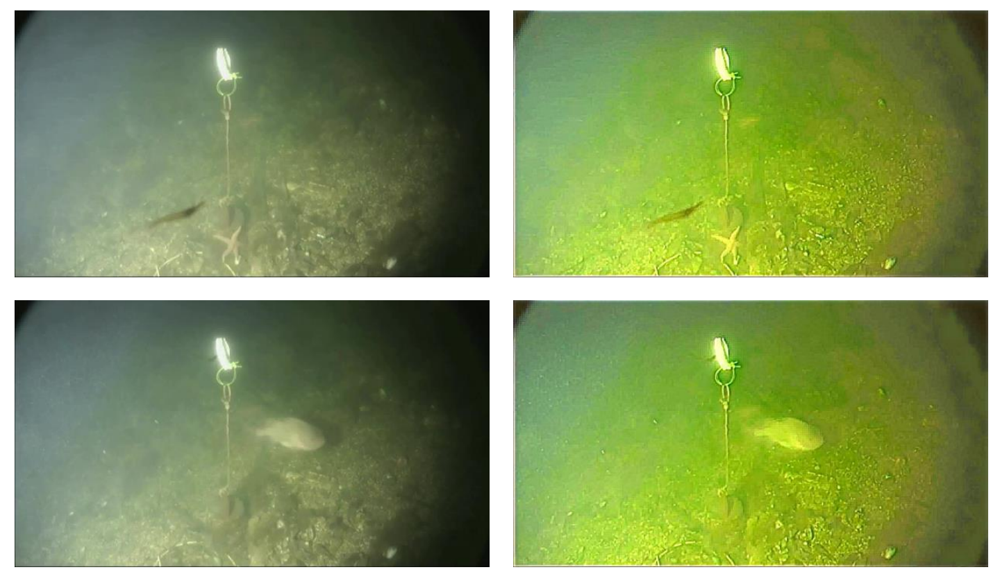
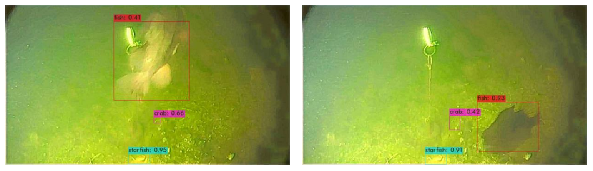

# Underwater Image Enhancement and Object Detection using MIRNet and YOLO

## MIRNet Image Enhancement

With the goal of recovering high-quality image content from its degraded version, image restoration enjoys numerous applications, such as in surveillance, computational photography, medical imaging, and remote sensing. Recently, convolutional neural networks (CNNs) have achieved dramatic improvements over conventional approaches for image restoration task. Existing CNN-based methods typically operate either on full-resolution or on progressively low-resolution representations. In the former case, spatially precise but contextually less robust results are achieved, while in the latter case, semantically reliable but spatially less accurate outputs are generated. MIRNet is a novel architecture with the collective goals of maintaining spatially precise high-resolution representations through the entire network, and receiving strong contextual information from the low-resolution representations. The core approach is a multi-scale residual block containing several key elements: (a) parallel multi-resolution convolution streams for extracting multi-scale features, (b) information exchange across the multiresolution streams, (c) spatial and channel attention mechanisms for capturing contextual information, and (d) attention based multi-scale feature aggregation. In a nutshell, the approach learns an enriched set of features that combines contextual information from multiple scales, while simultaneously preserving the highresolution spatial details. The source code and pre-trained models are available at MIRNet repository https://github.com/swz30/MIRNet. 

Conventional image restoration and enhancement pipelines either stick to the full resolution features along the network hierarchy or use an encoder-decoder architecture. The first approach helps retain precise spatial details, while the latter one provides better contextualized representations. However, these methods can satisfy only one of the above two requirements, although real-world image restoration tasks demand a combination of both conditioned on the given input sample. MIRNet is a novel architecture whose main branch is dedicated to full resolution processing and the complementary set of parallel branches provides better contextualized features. It proposes a novel mechanism to learn relationships between features within each branch as well as across multiscale branches.

Figure 1. MIRNET Enhancement Samples

## YOLO Object Detection

YOLO is an abbreviation for the term ‘You Only Look Once’. This is an algorithm  that detects and recognizes various objects in a picture (in real-time). Object  detection in YOLO is done as a regression problem and provides the class  probabilities of the detected images. YOLO algorithm employs convolutional neural  networks (CNN) to detect objects in real-time. As the name suggests, the algorithm  requires only a single forward propagation through a neural network to detect  objects. This means that prediction in the entire image is done in a single algorithm  run. The CNN is used to predict various class probabilities and bounding boxes  simultaneously. 

Compared to other region proposal classification networks (fast RCNN) which perform detection on various region proposals and thus end up performing prediction multiple times for various regions in a image, Yolo architecture is more like FCNN (fully convolutional neural network) and passes the image (N x N)  once through the FCNN and output is (M x M) prediction. This the architecture is  splitting the input image in (M x M) grid and for each grid generation 2 bounding  boxes and class probabilities for those bounding boxes. Note that bounding box is  more likely to be larger than the grid itself. 

We reframe object detection as a single regression problem, straight from image  pixels to bounding box coordinates and class probabilities. A single convolutional network simultaneously predicts multiple bounding boxes  and class probabilities for those boxes. YOLO trains on full images and directly  optimizes detection performance. This unified model has several benefits over  traditional methods of object detection.  

First, YOLO is extremely fast. Since we frame detection as a regression problem,  we don’t need a complex pipeline. We simply run the neural network on a new image  at test time to predict detections. Second, YOLO reasons globally about the image when making predictions. Unlike  sliding window and region proposal-based techniques, YOLO sees the entire image  during training and test time, so it implicitly encodes contextual information about  classes as well as their appearance. Fast R-CNN, a top detection method,  mistakes background patches in an image for objects because it can’t see the larger  context. YOLO makes less than half the number of background errors compared to  Fast R-CNN. Third, YOLO learns generalizable representations of objects. When trained  on natural images and tested on artwork, YOLO outperforms top detection methods  like DPM and R-CNN by a wide margin. Since YOLO is highly generalizable it is  less likely to break down when applied to new domains or unexpected inputs. 

The network uses features from the entire image to predict each bounding box. It  also predicts all bounding boxes across all classes for an image simultaneously. This  means the network reasons globally about the full image and all the objects in the  image. The YOLO design enables end-to-end training and real-time speeds while  maintaining high average precision. 

Figure 2. YOLO Detection Samples

## Dataset Description

For the training, the Brackish Underwater Dataset is taken into account.  This is the first publicly available European underwater image dataset with bounding  box annotations of fish, crabs, and other marine organisms. It has been recorded in  Limfjorden, which is a brackish strait that runs through Aalborg in the northern part  of Denmark. The camera setup used for capturing the data consists of three cameras  and three LED lights mounted permanently on a concrete pillar of the Limfjords  bridge. However, only data from a single camera has so far been annotated and  published, but more will be added during 2019. The setup is located 9m below  surface and a single LED light has been turned on during all the recordings, which  explains some slightly odd behaviors of the animals, such as the schooling of the  sticklebacks directly in front of the camera.
